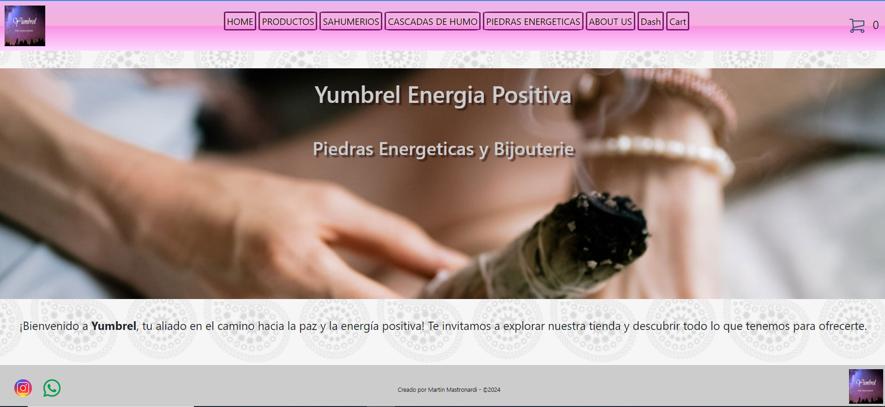

# Proyecto CoderHouse - Tienda ECommerce

## introduccion
Proyecto creado para el curso de React Js Flex - Comision 60755
Tienda de ECommerce para la marca Yumbrel, enfocada en articulos de limpieza aurica, piedras energeticas, Sahumerios, etc...
### Tecnologias
- Este proyecto fue creado con **React JS**
- Los estilos estan en **css** y **Bootstrap React**
- La compilacion del proyecto es realizada con **Vite**
#### Como instalar
1 - Clonar repositorio de GitHub [Aqui](https://github.com/martinmastronardi/React-JS/tree/main/EntregaFinal%2BMastronardi/mitienda-vit) 
2 - Abrir **cmd** en la ruta del proyecto
3 - Ejecutar ```npm install``` para instalar dependencias.
4 - Ejecutar ```npm run dev``` para correrlo.

## Screenshots


## Autor

- [@Martin Mastronardi](https://www.linkedin.com/in/martin-mastronardi-8aaa91133/)
